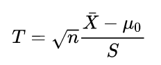
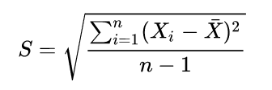

# CompStat
## Tests
### T-Test
*  Intuition:
	* We want to test for a normal distribution with mean u = u0
* Assumptions:
	* data are assumed to be Normal
	* unknown mean and sd

* Procedure:

### Wilcoxon
* See [Wilcoxon Test](https://www.graphpad.com/guides/prism/7/statistics/stat_interpreting_results_wilcoxon_.htm?toc=0&printWindow)

### Permutation Tests
* Intuition: 
	* Permutation tests are particularly relevant in experimental studies, where we are often interested in the sharp null hypothesis of no difference between treatment groups. Thus under the null hypothesis, we can shuffle the data (**Without** replacemenet, unlike bootstrapping)
* Procedure
	* See [Permutation Test](https://thomasleeper.com/Rcourse/Tutorials/permutationtests.html)
	* **To obtain p-value**: Count how many permuted mean-differences are larger than the one we observed in our actual data. We can then divide this by the number of items in our permutation distribution

## Plots
* Interpretation:
	* See [Understanding Plots](https://data.library.virginia.edu/diagnostic-plots)

## Multiple Testing
### Type I and II errors
* See [Type I & II Errors](https://stats.stackexchange.com/questions/148526/how-to-simulate-type-i-error-and-type-ii-error)

### Permutation Testing
* See "Solutions7.pdf" exercise 3.c)-f)